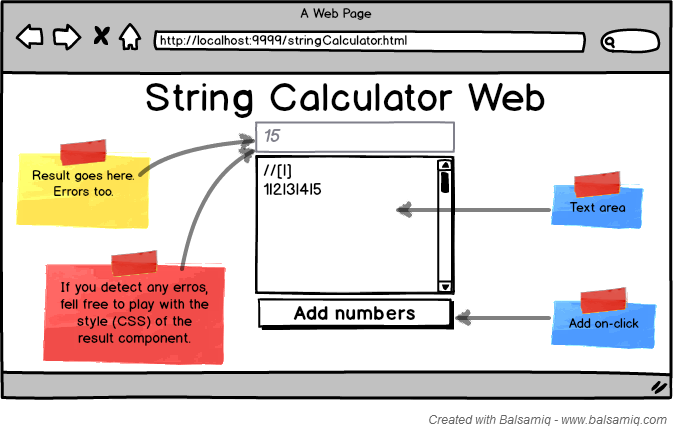

# Welcome young padawan! #

We'll like for you to demonstrate your skills using the following tools:

- JavaScript,
- C# (C Sharp),
- HTML5,
- CSS3, and
- TDD (any xUnit framework)

Here you have two programming challenges, you need to solve one using C# and the other using JavaScript. For the later (the one solved using JavaScript), you will create a plain old HTML+JavaScript+CSS application to, manually, test the solution. To serve that HTML GUI use anything from just the file system to a simple HTTP server.

For each challenge we will include some additional details for the HTML GUI component.

Do use TDD for both challenges and include your tests in the final solution.

***How to deliver the solution?***
Just fork this repo and submit your solution as a pull request.

***Due date*** 
The last day to submit your solution is ***before Sep. 20, 2015***.

---
## What aspects will we evaluate about your solutions? ##
Be aware, some assessments are subjective, such as our beliefs about good software engineering practices.

- **Your solution must work:** Please do not submit solutions not doing what was asked.
- **.NET solution:** Must run using only MSBuild tool, use .NET Framework 4 or any higher version
  - Put it inside `/dot_net` directory
- **JavaScript Solution:** Must run using the following command `node run.js`, will use node v12 or higher
  - Put it inside `/js` directory
- **OOP Principles:** We use Object Oriented technologies, we are looking for people with solid knowledge about OO principles. To name a few, we like you to know about:
  - S.O.L.I.D., 
  - Loosely coupled components, 
  - High cohesive components,
  - Encapsulation, polymorphism, and inheritance
- **Code Cleanness:** We love clean code. If you only care about *implementing what was asked*, and do not care a bit about *how it was implemented*, may this is not the place for you to work. 
  - Don't be confused ***we expect your code to work (do what was asked)***, but we will read your source code carefully to see how clean and well organized it is.
- **Maintainability:** Just to enforce the point, we need people able to produce code that can be read, and changed easily by anyone different from its original author.
- **Industry conventions**: You must follow all accepted industry conventions for the tool at hand:
  - Naming conventions for the language C# / JavaScript
  - File / class / method / variable declaration and organization
- **Automated tests:** Both solution must come with a suit of unit tests. Automated tests are not required for the HTML UI
- **Self-explained:** Your solutions must be organized in such a way that allows us to review it and test it without contacting you. If you need to do any clarification use the `README.md` file.

## What aspects will we evaluate about YOU? ##
If your code works, and we like it. We will make an appointment for an interview. You will be required to pass another set of technical and non-technical tests. Here we will list some, not all, aspects that we will be evaluating in that second round:

- **English level:** We need people able to read technical and non technical documentation in English. We also need people able to produce, at least, technical documentation / specifications in English. You need to be able to learn new things about your work using an English source. *We are not looking for a native speaker level, but if you already have that level of knowledge, your are welcome.*
- **Spanish level:** As with English, we expect you to be able to communicate effectively orally and written with your peers, clients and our executives. We do not want to have to oversee every communication you produce.
- **Team Player:** We use Agile, specifically Scrum and XP. We need you to be comfortable working as a team member. You will be required to talk and listen to others. We expect you to learn from others and teach others. We don't like the *us vs. them* mentality.
- **Self taught and eager to learn new things:** We can teach you a lot of things. Things related specifically to our product, software development skills and best practices, but with very frequently we face problems unknown for everyone on the team. In such situations we need you to seek and discover the solutions for yourself.

---
## Challenge One: ??? ##

---
## Challenge Two: String Calculator Kata (simplified) ##
See original kata description here [String Calculator Kata @ osherove.com](http://osherove.com/tdd-kata-1/ "String Calculator Kata").

### Before you start: ###
- Try not to read ahead
- Do one task at a time. The trick is to learn to work incrementally
- Make sure you only test for correct inputs. there is no need to test for invalid inputs for this kata

### Description ###
- *Create a simple String calculator with a method int `Add(string numbers)`*
  - The method can take 0, 1 or 2 numbers, and will return their sum (for an empty string it will return `0`) for example `“”` or `“1”` or `“1,2”`
  - Start with the simplest test case of an empty string and move to 1 and two numbers
  - Remember to solve things as simply as possible so that you force yourself to write tests you did not think about
  - Remember to refactor after each passing test
- *Allow the Add method to handle an unknown amount of numbers*
- *Allow the Add method to handle new lines between numbers (instead of commas)*
  - the following input is OK:  `“1\n2,3”`  (will equal `6`)
  - the following input is NOT OK:  `“1,\n”` (not need to prove it just clarifying)
- *Support different delimiters*
  - to change a delimiter, the beginning of the string will contain a separate line that looks like this:   `“//[delimiter]\n[numbers…]”` for example `“//;\n1;2”` should return three where the default delimiter is `‘;’` .
  - the first line is optional. all existing scenarios should still be supported
- *Calling Add with a negative number will throw an exception with message `“negatives not allowed”`* 
  - and the negative that was passed
  - if there are multiple negatives, show all of them in the exception message
  - message format will be `“negatives not allowed {num1 num2 ...}”`, where `{num1 num2 ...}` represents the list of negatives found

### Layout if opt to do the HTML UI ###

---

## Both problems are to easy for you? ##
Try with these ones on the [obi-wan profile](https://github.com/novosit/obi-wan "obi-wan profile").

