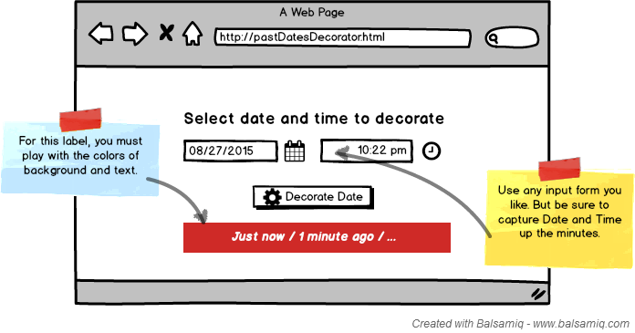

# Welcome young padawan! #

We'll like for you to demonstrate your skills using the following tools:

- JavaScript,
- C# (C Sharp),
- HTML (ideally 5),
- CSS (ideally 3), and
- TDD

Here you have two programming challenges, you need to solve one using C# and the other using JavaScript. For the later (the one solved using JavaScript), you will create a plain old HTML+JavaScript+CSS application to, manually, test the solution. To serve that HTML GUI use anything from just the file system to a simple HTTP server.

For each challenge we will include some additional details for the HTML GUI component.

## Challenge One: Past Dates Decorator ##

## Challenge Two: String Calculator (Simplified) ##
See original kata description here [String Calculator Kata @ osherove.com](http://osherove.com/tdd-kata-1/ "String Calculator Kata").

### Before you start: ###
- Try not to read ahead
- Do one task at a time. The trick is to learn to work incrementally
- Make sure you only test for correct inputs. there is no need to test for invalid inputs for this kata

### String Calculator ###
- *Create a simple String calculator with a method int `Add(string numbers)`*
  - The method can take 0, 1 or 2 numbers, and will return their sum (for an empty string it will return `0`) for example `“”` or `“1”` or `“1,2”`
  - Start with the simplest test case of an empty string and move to 1 and two numbers
  - Remember to solve things as simply as possible so that you force yourself to write tests you did not think about
  - Remember to refactor after each passing test
- *Allow the Add method to handle an unknown amount of numbers*
- *Allow the Add method to handle new lines between numbers (instead of commas)*
  - the following input is OK:  `“1\n2,3”`  (will equal `6`)
  - the following input is NOT OK:  `“1,\n”` (not need to prove it just clarifying)
- *Support different delimiters*
  - to change a delimiter, the beginning of the string will contain a separate line that looks like this:   `“//[delimiter]\n[numbers…]”` for example `“//;\n1;2”` should return three where the default delimiter is `‘;’` .
  - the first line is optional. all existing scenarios should still be supported
- *Calling Add with a negative number will throw an exception with message `“negatives not allowed”`* 
  - and the negative that was passed
  - if there are multiple negatives, show all of them in the exception message
  - message format will be `“negatives not allowed {num1 num2 ...}”`, where `{num1 num2 ...}` represents the list of negatives found
